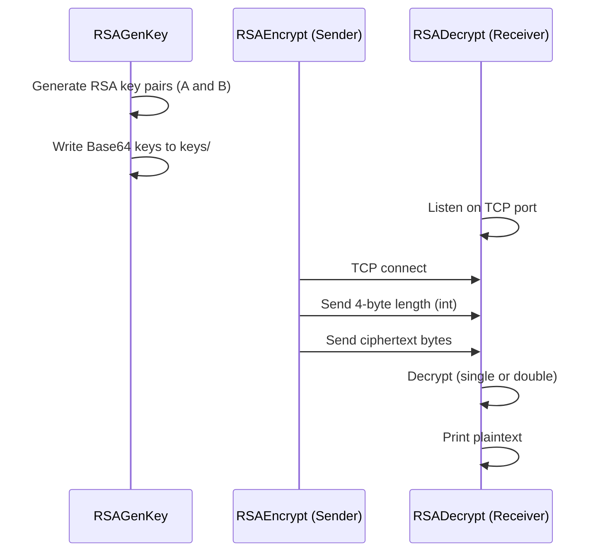

# RSA-SocketShield — RSA-Secured TCP Messaging (Java)

**Ultra-detailed academic README (coursework-oriented).**

**One-line (GitHub About, <350 chars):**
A Java client–server prototype for RSA-secured TCP messaging. Includes RSA key-pair generation, single-pass public-key encryption for confidentiality, and an optional two-stage RSA construction for origin authentication plus confidentiality, with framed binary transport.

---

## 1) What this project is
This repository demonstrates secure message transmission over TCP using RSA.

It implements three runnable programs:
- **Key generation**: generates RSA key pairs for *Sender (A)* and *Receiver (B)*.
- **Receiver server**: listens on a TCP port, receives ciphertext, decrypts it, prints plaintext.
- **Sender client**: reads a plaintext string from a local file, encrypts it, sends ciphertext to the receiver.

The design supports **two modes**:
- **Single RSA** (default): confidentiality only
- **Double RSA** (`--double`): educational “authentication + confidentiality” layering

> Note (important academic nuance): The “authentication” layer is implemented as “RSA with the sender private key”. In modern cryptographic engineering, you would normally use a *digital signature scheme* (e.g., RSA-PSS) rather than “private-key encryption”. This project keeps it intentionally simple for demonstration.

---

## 2) Repository contents

### Source files
- [RSAGenKey.java](RSAGenKey.java) — generates sender/receiver RSA key pairs
- [RSAEncrypt.java](RSAEncrypt.java) — sender (client): reads plaintext, encrypts, sends
- [RSADecrypt.java](RSADecrypt.java) — receiver (server): receives ciphertext, decrypts, prints
- [RSAKeyUtil.java](RSAKeyUtil.java) — shared constants + key I/O helpers

### Input file
- [name.txt](name.txt) — plaintext input used by the client

### Generated at runtime
- `keys/` — created by `RSAGenKey` (Base64-encoded key blobs)
- `*.class` — compiled bytecode produced by `javac`

---

## 3) Build and run

### 3.1 Prerequisites
- A Java JDK installed (the code uses standard `java.*` and `javax.crypto.*` APIs)

### 3.2 Compile
Run from the repository root:

```bash
javac *.java
```

### 3.3 Run order (must be followed)

1) **Generate keys** (run once, or whenever you want fresh keys)
```bash
java RSAGenKey
```

2) **Start receiver (server)** (Terminal 1)
```bash
java RSADecrypt
```

3) **Start sender (client)** (Terminal 2)
```bash
java RSAEncrypt
```

---

## 4) Command-line interface (CLI)

### 4.1 Mode selection
Both client and server must use the **same mode**.

- `--single` (default): single RSA mode
- `--double`: double RSA mode

Examples:
```bash
# Terminal 1
java RSADecrypt --double

# Terminal 2
java RSAEncrypt --double
```

### 4.2 Host and port
Defaults:
- Host: `localhost` (client only)
- Port: `54321` (both sides)

Receiver:
```bash
java RSADecrypt --port 6000
```

Sender:
```bash
java RSAEncrypt --host localhost --port 6000
```

---

## 5) System architecture (how the pieces fit)

### 5.1 Roles
- **Sender A (client)**: reads plaintext, encrypts, transmits
- **Receiver B (server)**: accepts connection, receives ciphertext, decrypts, prints

### 5.2 End-to-end flow


---

## 5.3 Code walkthrough (flow logic from start to finish)

This section explains the code in the exact order you run it in real life, and shows how each class calls the next logical step.

### Step A — Generate keys (run first): `java RSAGenKey`

**Goal:** create RSA key pairs for Sender (A) and Receiver (B), and write them to disk.

Execution flow:
1) `RSAGenKey.main(...)` prints the configured RSA key size (`RSAKeyUtil.KEY_SIZE`).
2) It calls `RSAKeyUtil.generateKeyPair()` twice:
   - once for the sender (A)
   - once for the receiver (B)
3) Each `KeyPair` is stored via `RSAKeyUtil.saveKeyPair(pair, prefix)`.

What `RSAKeyUtil.saveKeyPair(...)` does:
- ensures `keys/` exists (`Files.createDirectories`)
- writes two files per identity:
  - `keys/<prefix>_private.key` (Base64-encoded PKCS#8 private key)
  - `keys/<prefix>_public.key` (Base64-encoded X.509 public key)

This step produces the artifacts that both networking programs depend on.

### Step B — Start the receiver server (run second): `java RSADecrypt`

**Goal:** listen for one TCP client, receive a single ciphertext message, decrypt, and print.

Execution flow:
1) `RSADecrypt.main(args)` decides the mode:
   - `RSAKeyUtil.isDoubleMode(args)` returns `true` if `--double` is present, otherwise `false`.
2) It decides the port via `parsePort(args)` (default `54321`).
3) It loads keys from `keys/`:
   - receiver private key: `RSAKeyUtil.loadPrivateKey("receiver")` → needed for confidentiality decryption
   - sender public key: `RSAKeyUtil.loadPublicKey("sender")` → needed only in double mode (inner verification layer)
4) It opens the server socket:
   - `new ServerSocket(port)`
   - blocks on `accept()` until a client connects
5) It reads ciphertext from the socket using `readFramed(in)`:
   - reads a 4-byte `int length`
   - validates length (basic safety)
   - reads exactly `length` bytes
6) It chooses the correct decryption routine:
   - single mode: `decryptSingle(ciphertext, receiverPrivate)`
   - double mode: `decryptDouble(ciphertext, receiverPrivate, senderPublic)`
7) It converts plaintext bytes to UTF-8 and prints.

Single decryption (confidentiality only):
- `decryptSingle(...)` creates a `Cipher` using `RSAKeyUtil.CIPHER_PKCS1` (`RSA/ECB/PKCS1Padding`)
- initializes with receiver private key (`Cipher.DECRYPT_MODE`)
- runs `doFinal(ciphertext)` to produce plaintext bytes

Double decryption (reverse of client’s double encryption):
1) Step 1: `RSA/ECB/NoPadding` with receiver private key → removes the outer confidentiality layer
2) Step 2: `RSA/ECB/PKCS1Padding` with sender public key → removes/verifies the inner layer and yields plaintext

### Step C — Run the sender client (run last): `java RSAEncrypt`

**Goal:** read plaintext from a file, encrypt according to mode, connect to the server, send one ciphertext message.

Execution flow:
1) `RSAEncrypt.main(args)` decides the mode via `RSAKeyUtil.isDoubleMode(args)`.
2) It reads networking parameters:
   - host via `parseOption(args, "--host", "localhost")`
   - port via `parsePort(args)` (default `54321`)
3) It loads keys from `keys/`:
   - sender private key: `RSAKeyUtil.loadPrivateKey("sender")` (needed only in double mode inner layer)
   - receiver public key: `RSAKeyUtil.loadPublicKey("receiver")` (confidentiality)
4) It loads plaintext via `loadPlaintext()`:
   - reads `name.txt`
   - trims/pads to exactly 10 characters
5) It converts plaintext to bytes (`UTF-8`).
6) It encrypts:
   - single mode: `encryptSingle(plaintextBytes, receiverPublic)`
   - double mode: `encryptDouble(plaintextBytes, senderPrivate, receiverPublic)`
7) It opens a TCP socket to the receiver and writes a framed message:
   - `out.writeInt(ciphertext.length)`
   - `out.write(ciphertext)`

Single encryption:
- `encryptSingle(...)` uses `RSA/ECB/PKCS1Padding` with the receiver public key.

Double encryption (two-stage):
1) Inner: `RSA/ECB/PKCS1Padding` with sender private key
2) Outer: `RSA/ECB/NoPadding` with receiver public key

At this point, the receiver’s `readFramed(...)` reads the same length+bytes, and its decryption reverses the sender’s encryption steps.

---

## 6) Network protocol (framing)
TCP is a byte stream, so the receiver needs a clear message boundary. This project uses **length-prefix framing**:

Client (`RSAEncrypt`) writes:
1) `int length` — ciphertext length in bytes
2) `byte[length]` — ciphertext bytes

Server (`RSADecrypt`) reads:
1) `int length`
2) reads exactly `length` bytes (`readFully`)

Why this matters:
- Without framing, the receiver cannot reliably know where the ciphertext ends.
- The server also validates the length to avoid allocating huge buffers.

---

## 7) Plaintext handling (10-character rule)
The sender reads plaintext from [name.txt](name.txt) and normalizes it to **exactly 10 characters**:
- If longer than 10 → **trim** to 10
- If shorter than 10 → **pad with spaces** to 10

This keeps the demo deterministic and keeps the plaintext small (RSA is not intended for large bulk data).

---

## 8) Cryptographic design (single vs double RSA)

### 8.1 Key notation
- Sender A:
  - Public key: **KUA**
  - Private key: **KRA**
- Receiver B:
  - Public key: **KUB**
  - Private key: **KRB**

### 8.2 Single RSA mode (confidentiality)
Goal: only Receiver B can recover plaintext.

Conceptual equation:
- **Encrypt**: `C = E_KUB(P)`
- **Decrypt**: `P = D_KRB(C)`

Code mapping:
- Client encryption: `encryptSingle(...)` in [RSAEncrypt.java](RSAEncrypt.java)
- Server decryption: `decryptSingle(...)` in [RSADecrypt.java](RSADecrypt.java)

Cipher transformation:
- `RSA/ECB/PKCS1Padding`

### 8.3 Double RSA mode (authentication + confidentiality; educational)
Goal: demonstrate a layered construction:
1) Inner layer: “origin authentication” by using Sender A’s private key
2) Outer layer: confidentiality by using Receiver B’s public key

Conceptual equations:
- Inner: `X = E_KRA(P)`
- Outer: `C = E_KUB(X)`
- Receiver reverses: `X = D_KRB(C)` then `P = D_KUA(X)`

Code mapping:
- Client encryption: `encryptDouble(...)` in [RSAEncrypt.java](RSAEncrypt.java)
- Server decryption: `decryptDouble(...)` in [RSADecrypt.java](RSADecrypt.java)

#### Why `NoPadding` appears in double mode
Double RSA uses two different transformations:
- Step 1 (inner): `RSA/ECB/PKCS1Padding`
- Step 2 (outer): `RSA/ECB/NoPadding`

Reason: a full PKCS#1-padded RSA block cannot generally be PKCS#1-padded and encrypted a second time without violating the RSA block-size constraints. The project uses `NoPadding` on the outer layer to keep the block size valid.

> Security note: `NoPadding` is not recommended for real deployments; it is used here strictly to illustrate the “double RSA” concept within modulus-sized blocks.

---

## 9) Key generation and storage

### 9.1 Key size
- `2048-bit` RSA (see `RSAKeyUtil.KEY_SIZE` in [RSAKeyUtil.java](RSAKeyUtil.java))

### 9.2 Storage format
Keys are stored under `keys/` as Base64-encoded DER blobs:
- `sender_private.key` — PKCS#8 private key encoding
- `sender_public.key` — X.509 public key encoding
- `receiver_private.key` — PKCS#8
- `receiver_public.key` — X.509

The utility class [RSAKeyUtil.java](RSAKeyUtil.java) handles serialization and parsing.

### 9.3 Regenerating keys
Delete `keys/` and rerun:
```bash
java RSAGenKey
```

---

## 10) Expected output (what you should see)
Typical run prints:
- Mode selection (single/double)
- The plaintext on the sender before encryption
- Ciphertext displayed as Base64 and its length
- The decrypted plaintext on the receiver

Ciphertext differs across runs because PKCS#1 padding introduces randomness.

---

## 11) Troubleshooting

### 11.1 “Missing keys/…”
Run key generation first:
```bash
java RSAGenKey
```

### 11.2 Client cannot connect
- Start the receiver first.
- Ensure host/port match on both sides.
- If using different machines, check firewall rules.

### 11.3 Port already in use
Pick another port:
```bash
java RSADecrypt --port 6000
java RSAEncrypt --port 6000
```

### 11.4 “Missing name.txt”
Create [name.txt](name.txt). The sender will pad/trim to 10 characters automatically.

---

## 12) Limitations (explicitly stated)
This is a didactic prototype, not production security software.

Not implemented:
- TLS / certificate validation / PKI
- Replay protection (nonces/timestamps)
- Forward secrecy
- Hybrid encryption (RSA + AES), which is standard for larger messages
- Modern RSA encryption padding (OAEP) and signature padding (PSS)

---

## 13) Academic statement
This project is intended for secure-systems coursework to demonstrate core concepts: RSA key generation, basic public-key confidentiality, and an educational double-layer construction with framed TCP transport.
